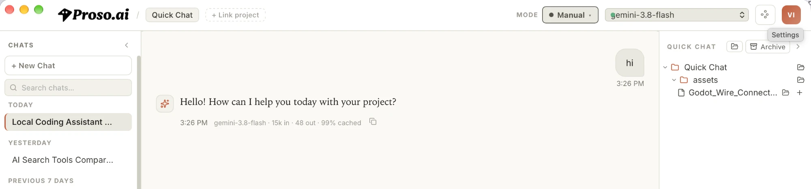
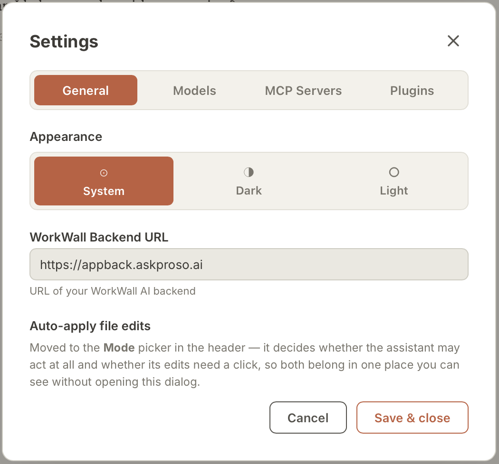
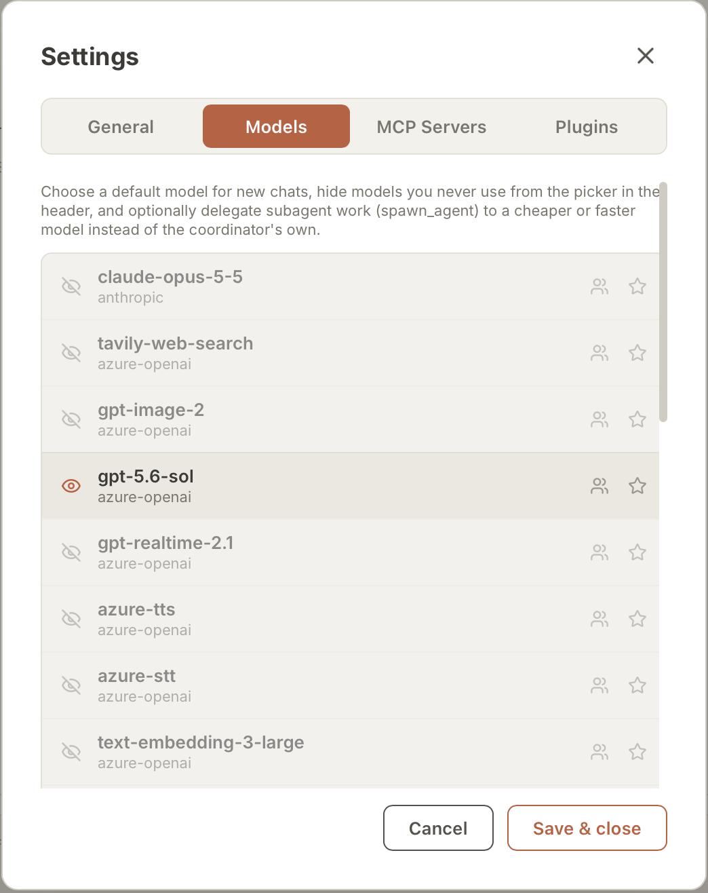

# CodeProso

CodeProso is a desktop AI coding assistant, powered by the [Proso.ai](https://askproso.ai) platform. It sits directly on top of your local project folder, so it can read your files, propose edits, run commands, and chat with you about your codebase — all from a native app on your machine.



## Download

Grab the latest build for your platform from the [Releases page](https://github.com/prosoai/codeproso-releases/releases/latest):

| Platform | Download |
| --- | --- |
| macOS (Apple Silicon + Intel) | [codeproso-darwin-universal.zip](https://github.com/prosoai/codeproso-releases/releases/download/v0.1.0/codeproso-darwin-universal.zip) |
| Windows (64-bit) | [codeproso-windows-amd64-setup.exe](https://github.com/prosoai/codeproso-releases/releases/download/v0.1.0/codeproso-windows-amd64-setup.exe) |

> **macOS note:** the app isn't notarized yet, so on first launch you may need to right-click the app and choose **Open**, or allow it under **System Settings → Privacy & Security**.

## Getting Started

### 1. Sign up on Proso.ai

CodeProso is the desktop half of the Proso.ai platform. [Create a free account at askproso.ai](https://askproso.ai) before you launch the app — signing up unlocks the full experience across **both the web app and the desktop app**, including:

- Chat history synced across web and desktop
- Access to the full model catalog (Anthropic, OpenAI, Gemini, and more)
- Usage and billing dashboard
- Project-level context shared between AskProso (web) and CodeProso (desktop)

### 2. Point the app at your backend

Open **Settings** (top-right corner of the app), and under **General → WorkWall Backend URL**, set it to:

```
https://appback.askproso.ai
```

This is the endpoint CodeProso talks to for chat, models, and your account data.



### 3. Choose your models

Head to **Settings → Models** to control which models show up in the model picker:

- Click the **eye icon** next to a model to show or hide it from the picker — a good way to trim the list down to the models you actually use.
- Click the **star icon** to mark a model as a favorite / default, so it's front-and-center every time you start a new chat.



### 4. Start chatting

Use **+ New Chat** or **Quick Chat** to start a conversation, and **+ Link project** / **+ Add Folder** to bring a local project into scope so the assistant can read and edit it directly.

## What CodeProso Can Do

- **Project-aware chat** — reads your files, project structure, and git state to answer questions and make changes with real context.
- **Plan vs. Build modes** — `Plan` mode is read-only for thinking through a problem safely; `Build` mode can propose and apply file edits, run formatters, and execute terminal commands.
- **File editing with review** — proposed changes are shown as diffs you can review and apply, with checkpoint history so you can undo.
- **Office file support** — reads and edits `.docx`/`.pptx`/`.xlsx` files directly.
- **Multi-model** — switch between Anthropic, OpenAI, Gemini, and other models depending on the task.

## Getting Help

If you run into an issue, please [open an issue](https://github.com/prosoai/codeproso-releases/issues) on this repo with:

- Your OS and CodeProso version
- What you were trying to do
- Any error message shown in the app

---

Built by the [Proso.ai](https://askproso.ai) team.
